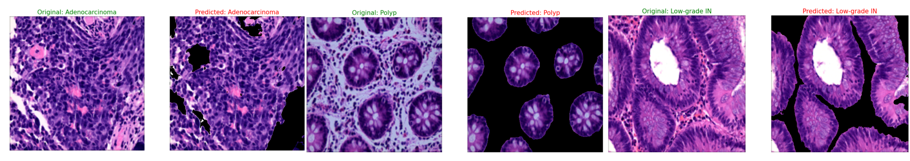

# Histopathology Image Segmentation and Classification with EBHI-Seg Dataset

## Outcome


## Overview

This project is focused on performing **simultaneous image segmentation and classification** on histopathology images from the **EBHI-Seg dataset**, using advanced deep learning models. The dataset contains **4,456 histopathology images**, along with their corresponding **ground truth images**, categorized into six different types of differentiation stages:  

- Normal  
- Polyp  
- Low-grade intraepithelial neoplasia  
- High-grade intraepithelial neoplasia  
- Serrated adenoma  
- Adenocarcinoma  

The primary objective of this project is to **segment regions of interest** in these histopathology images while **classifying them into their respective differentiation stages**. This dual-task approach enables a more comprehensive analysis of **colon cancer histopathology**, aiding in automated diagnosis and medical research. The segmentation model isolates the affected regions, while the classification head predicts the disease stage, providing valuable insights for clinical decision-making.

## Dataset

The **EBHI-Seg dataset** contains 2,228 **histopathology section images** and 2,228 **ground truth images**, covering six categories with various stages of histological differentiation. The images are **H&E-treated** and have a magnification of **400×** with an **image input size of 224×224 pixels**. The data is publicly available and can be accessed via this link:  
[EBHI-Seg Dataset on Figshare](https://figshare.com/articles/dataset/EBHI-SEG/21540159/1)

### Dataset Details:
- **Normal**: 76 images and 76 ground truth images
- **Polyp**: 474 images and 474 ground truth images
- **Low-grade intraepithelial neoplasia**: 639 images and 639 ground truth images
- **High-grade intraepithelial neoplasia**: 186 images and 186 ground truth images
- **Serrated adenoma**: 58 images and 58 ground truth images
- **Adenocarcinoma**: 795 images and 795 ground truth images

## Model

The **UnetPlusPlusWithClassification** model is used for this project, integrating the **Unet++ architecture** for image segmentation and a **classification head** for multi-class classification. The model is designed to segment and classify histopathology images simultaneously. 

- **Encoder**: Pretrained **ResNeXt50** model  
- **Decoder**: **Unet++ Decoder**  
- **Segmentation Head**: Outputs segmented masks  
- **Classification Head**: Outputs predictions for differentiation stages (6 classes)  

## Installation

To use the code, clone the repository and install the necessary dependencies:

```bash
git clone https://github.com/yourusername/EBHI-Segmentation.git
cd EBHI-Segmentation
